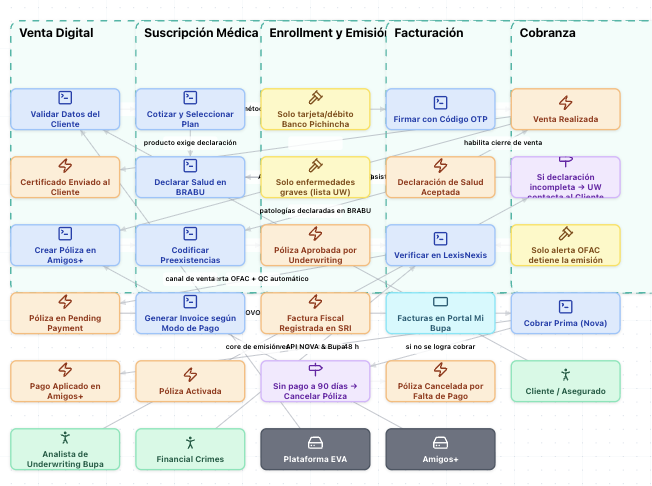
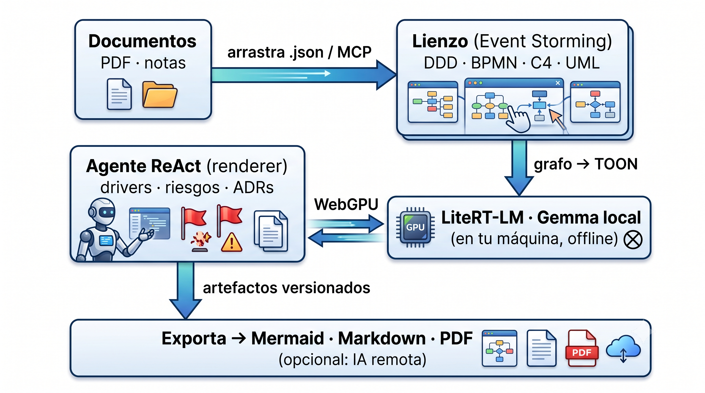
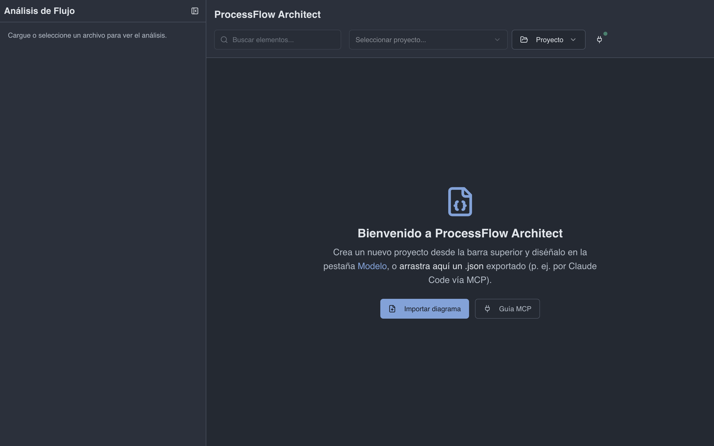
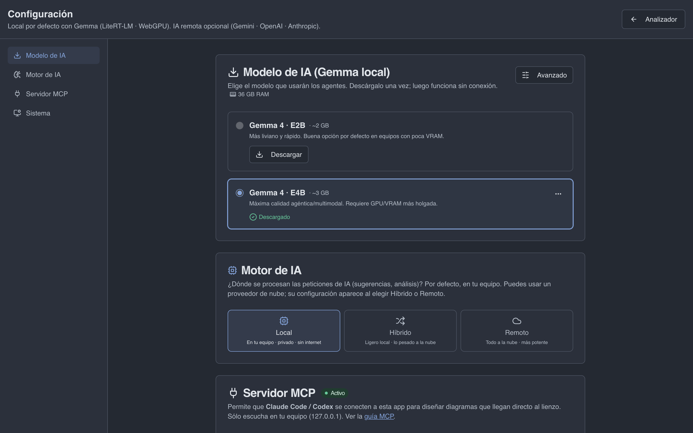
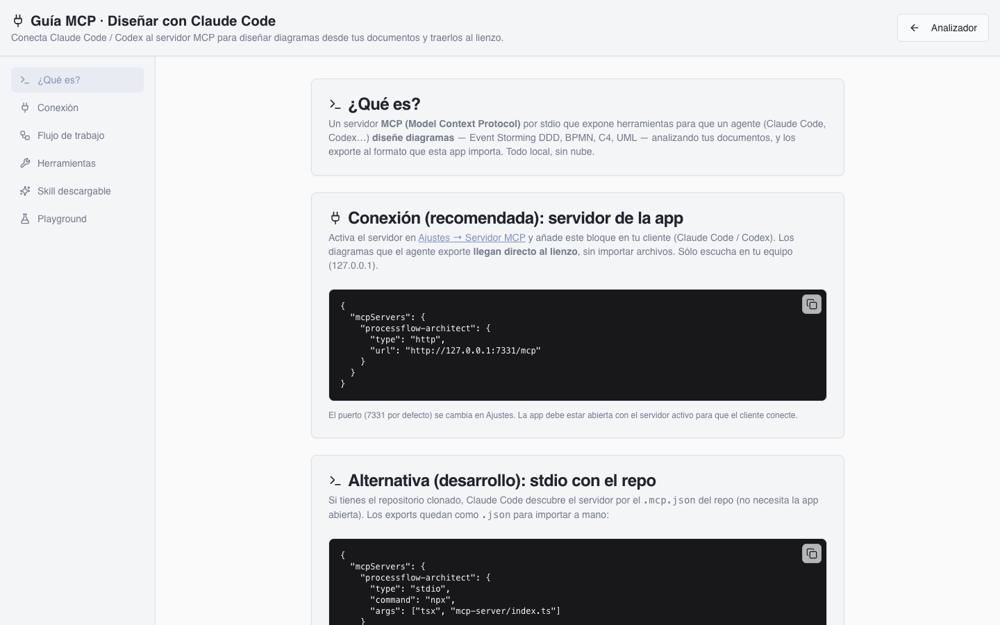
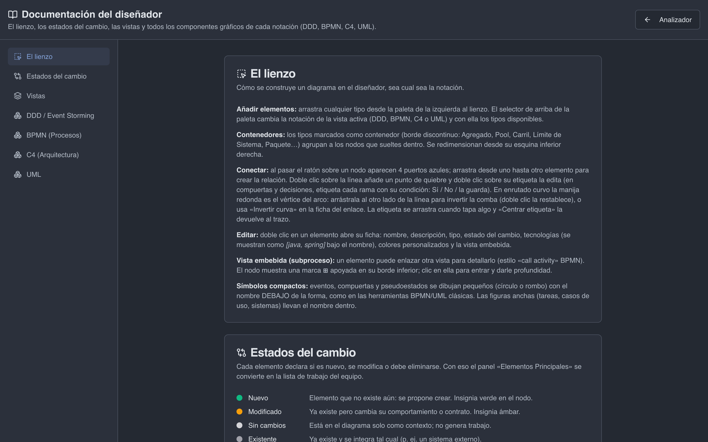
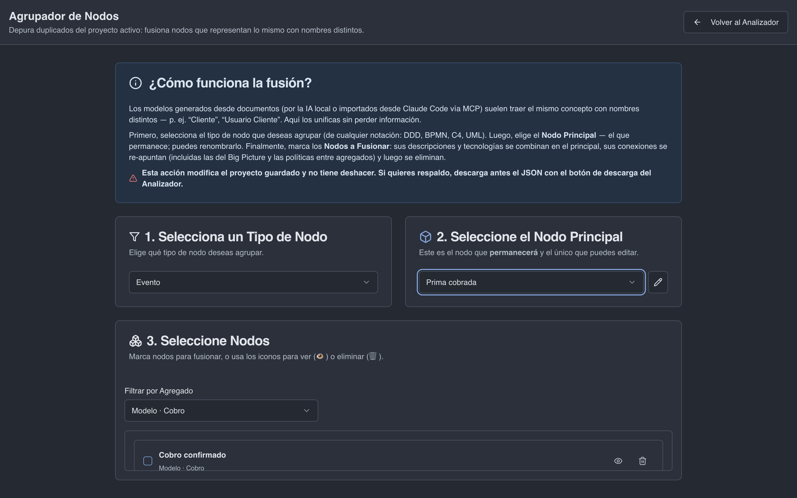

<div align="center">

# ProcessFlow Architect

### El estudio de Event Storming con IA que corre **en tu máquina**

**Modela dominios complejos y diseña arquitectura con un agente de IA — 100 % local, offline, sin enviar tus datos a la nube.**
Event Storming · DDD · BPMN · C4 · UML · agente ReAct local · exporta a Mermaid / Markdown / PDF · offline-first

<br/>


</div>

<div align="center">



<sub>captura real · Big Picture de Event Storming — agregados en bandas, paleta de la notación activa a la izquierda y pestañas de vistas abajo</sub>

</div>

---

> **Versión beta.** El modelo, las vistas y el agente local siguen en evolución: el formato de
> los proyectos puede cambiar entre versiones. La app lo dice en su cabecera y en «Acerca de».

## Qué hace

- **Event Storming Big Picture** — lienzo con eventos, comandos, agregados, políticas, read models y sistemas externos.
- **Agente de IA local (ReAct)** — chatéale a tu dominio y te devuelve artefactos versionados y editables: drivers, riesgos, propuesta técnica, roadmap, ADRs y diagramas. Cada artefacto guarda su historial y cita de dónde salió.
- **Cuatro notaciones** — DDD / BPMN / C4 / UML por vista; la paleta y la IA siguen la notación de cada vista.
- **Vistas DDD** — por agregado (deterministas) + Big Picture estratégica, CQRS Data Flow y Read Model Graph. Hasta 50 vistas, inyectables al chat del agente.
- **Lienzo de verdad** — copiar/pegar y menú contextual, ficha que se guarda sola, subprocesos embebidos (estilo *call activity*), filtros por tipo y organización automática del layout.
- **Puente MCP** — Claude Code / Codex diseñan diagramas desde tus documentos y los exportan directo al lienzo.
- **Fusión de sesiones** — combina varios workshops y depura duplicados (`/merger`).
- **Exportación** — Mermaid, Markdown estructurado y PDF.
- **Offline-first** — toda la inferencia corre local con **LiteRT-LM sobre WebGPU**. Cero llamadas a la nube por defecto.

---

## Cómo funciona (30 segundos)



La IA se ejecuta en el **renderer** porque LiteRT-LM necesita WebGPU (contexto seguro).
El proceso **main** solo gestiona los modelos `.litertlm`, la exportación a PDF, el
portapapeles y las llamadas a la nube **si** el usuario activa un proveedor remoto.

---

## Instalar

**Como usuario** — instaladores en [**Releases**](https://github.com/raalzate/processflow-architect/releases):

| Sistema | Archivo | Primera apertura |
|---|---|---|
| macOS (Apple Silicon) | `Processflow-Architect-<versión>-arm64.dmg` | clic derecho → **Abrir** (los binarios van con firma ad-hoc, no notarizados) |
| Windows | `Processflow-Architect.Setup.<versión>.exe` | SmartScreen → **Más información** → **Ejecutar de todas formas** |
| Linux | `Processflow-Architect-<versión>.AppImage` | `chmod +x` y ejecutar |

**Desde el código** — 60 segundos:

```bash
git clone https://github.com/raalzate/processflow-architect
cd processflow-architect
npm install            # postinstall reconstruye módulos nativos de Electron
npm run electron-dev   # Next.js + Electron + tsc watch
```

Y en la app, la primera vez:

1. Abre **Ajustes** y descarga un modelo Gemma (`.litertlm`) — una vez; luego funciona sin conexión.
2. Crea un proyecto o **arrastra un `.json`** exportado por Claude Code vía MCP al lienzo.
3. Pídele al **Agente de Arquitectura** que diseñe o analice: los artefactos aparecen en el lienzo.

> **Requisitos:** Node.js 20+ · GPU con soporte **WebGPU** (obligatorio para la IA local) · macOS · Windows · Linux.
> Sin WebGPU la IA local no arranca: queda la opción de activar un proveedor remoto con tu propia llave.

---

## Capturas

| Bienvenida | Ajustes · IA local |
|---|---|
|  |  |
| **Guía MCP** | **Documentación in-app** |
|  |  |

<div align="center">



<sub>Agrupador de nodos — depura duplicados del proyecto activo («Prima cobrada» ← «Cobro confirmado»)</sub>

</div>

---

## Notaciones

Cada vista declara su notación desde un registro (`src/lib/notations.ts`) y el agente la respeta.

| Notación | Para qué | Elementos típicos |
|----------|----------|-------------------|
| **DDD / Event Storming** | Big Picture y diseño táctico | Evento · Comando · Agregado · Política · Read Model · Sistema Externo |
| **BPMN** | Procesos de negocio | Pool · Tarea · Gateway · Subproceso (call activity vía `viewRef`) |
| **C4** | Paisaje de sistemas | Persona · Sistema · Contenedor · Componente |
| **UML** | Estructura e interacción | Clase · Interfaz · Componente · Nodo de despliegue · Caso de uso · Máquina de estados · Secuencia: Línea de vida (contenedor) + Mensaje (arista, punteada = retorno) |

En UML el **tipo de relación lo dice la punta**: flecha (asociación), triángulo hueco (herencia),
triángulo punteado (realización), rombo relleno (composición), rombo hueco (agregación) y punteada
con flecha (dependencia).

---

## Cuándo usarlo · cuándo no

**Úsalo cuando:**
- Facilitas Event Storming Big Picture y quieres pasar del post-it al modelo vivo.
- Necesitas asistencia de IA **sin sacar los datos del dominio de tu máquina**.
- Quieres que Claude Code diseñe diagramas desde tus documentos y los traiga al lienzo (MCP).

**Quizá no lo necesites si:**
- Solo buscas un editor de diagramas genérico sin modelo de dominio detrás.
- No tienes GPU con WebGPU y no piensas activar un proveedor de IA remoto.

---

## Motor de IA · local por defecto, nube opt-in

`ProviderId = "local" | "remote"`. El conmutador (`src/lib/ai/remote-settings.ts`) tiene tres modos:

| Modo | Comportamiento |
|------|----------------|
| **`local`** (por defecto) | Todo corre local con LiteRT-LM · Gemma sobre WebGPU. |
| **`hybrid`** | Tareas ligeras en local; las pesadas / estructuradas o de entrada grande van a la nube. |
| **`remote`** | Todo a la nube (Gemini · OpenAI · Anthropic). |

> **Seguridad de llaves:** se guardan **cifradas con `safeStorage`** en el proceso main
> (`userData/ai-keys.json`). NUNCA llegan al renderer ni se loguean; las peticiones HTTP a los
> proveedores se hacen SOLO en el main. No se añaden SDKs de nube: se usa `fetch` nativo.

---

## Stack técnico

| Capa | Tecnología |
|------|-----------|
| Runtime de escritorio | Electron 39 |
| Frontend | Next.js 15 (App Router) · React 18 · TypeScript 5 |
| UI | shadcn/ui · Radix UI · Tailwind CSS · Lucide |
| Grafos | D3 · dagre · reactflow |
| IA local | **LiteRT-LM (`@litert-lm/core`) sobre WebGPU**, en el renderer |
| Exportación | md-to-pdf · Puppeteer · Mermaid CLI |
| Pruebas | Vitest + cobertura v8 |
| Empaquetado | electron-builder 26 |

---

## Estructura del proyecto

```
processflow-architect/
├── main.ts                 ← entrada del proceso principal de Electron
├── preload.ts              ← puente seguro renderer↔main (window.electronAPI)
├── main/                   ← proceso main: ipc, ventana, logger, servicios
│   └── services/           ← pdf, mermaid, gestión de modelos litert, IA remota
├── src/app/                ← rutas Next.js (home · settings · mcp · docs · merger)
├── src/components/         ← UI (graph · ai-panel · canvas · views · ui)
├── src/context/            ← estado global (Graph · Agent · Views · Reference)
├── src/hooks/              ← hooks y handlers de UI
├── src/lib/                ← lógica pura testeable (grafo · ia · artefactos · notaciones)
│   └── ai/                 ← router · proveedores · tasks · motor LiteRT · graph-toon
├── mcp-server/             ← servidor MCP (stdio · http) para Claude Code / Codex
├── scripts/                ← el gate y sus señales (lint, self-test, link-check, capturas)
├── .claude/ · .githooks/   ← el arnés: hooks del agente y del repo
├── docs/                   ← arquitectura, arnés, gotchas, releases
└── specs/                  ← especificaciones de features (ruta SDD)
```

---

## Desarrollo y build

```bash
npm run electron-dev         # entorno completo (Next.js + Electron + tsc watch)
npm run dev                  # solo el frontend Next.js

npm run gate                 # EL entregable: arnés · docs · lint · typecheck · tests · build
npm run gate:fast            # lo mismo sin build (señal de desarrollo, NO entregable)

npm run typecheck            # tsc renderer + electron, sin emitir
npm test                     # pruebas unitarias (Vitest, offline por diseño)
npm run test:coverage        # pruebas + cobertura
npm run lint                 # convenciones del repo (pureza de lib/, notación, WebGPU…)

npm run hooks:install        # pre-commit y post-commit reales (core.hooksPath=.githooks)
npm run graph:query "…"      # consulta el índice del repo (graphify) en vez de leer archivos
npm run screenshots          # rehace las capturas del README contra la UI real

npm run build                # Next.js + tsc electron → build/
npm run electron-build:mac   # genera .dmg
npm run electron-build:win   # genera instalador .exe
```

Los instaladores de Linux (`AppImage`) los produce CI en el tag; ver [`docs/RELEASE.md`](docs/RELEASE.md).

---

## Cómo se trabaja en este repo

Nada se entrega sin `npm run gate` verde — es la **única** definición de entregable, y la corren
los tres actores con el mismo comando: la persona, el agente de IA y CI.

| Pieza | Qué es |
|---|---|
| [`CONSTITUTION.md`](CONSTITUTION.md) | los principios que no se negocian; cada uno dice **qué comando falla** si se viola |
| [`docs/harness/harness.md`](docs/harness/harness.md) | el arnés: señales del gate, hooks del agente y del repo, subagentes |
| [`docs/harness/gotchas.md`](docs/harness/gotchas.md) | incidentes con síntoma → causa → regla → **mecanismo**. Un gotcha sin mecanismo es gate rojo |
| [`docs/architecture/reuse-patterns.md`](docs/architecture/reuse-patterns.md) | catálogo de abstracciones: se consulta **antes** de escribir código |
| `graphify-out/` (local) | índice consultable del repo: `npm run graph:query "…"` devuelve un subgrafo, no el árbol |

Reglas de fondo: la lógica pura vive en `src/lib/` y va con prueba (TDD); la suite corre
**offline** (un test que sale a la red falla); las funciones de IA se agregan declarando una
`AiTask`, sin tocar el router; y el lienzo nunca queda en blanco.

---

## Documentación

**Empieza aquí**
- → [Arquitectura interna y flujo de datos](docs/ARCHITECTURE.md)
- → Documentación del diseñador · **in-app** (menú Ayuda → Documentación)

**Profundiza**
- → [Puente MCP: cómo Claude Code diseña y exporta al lienzo](docs/architecture/mcp.md) · [servidor](mcp-server/README.md)
- → [Guía de releases y firma de código](docs/RELEASE.md)
- → [Compresión del grafo para el contexto de la IA (TOON)](docs/compresion-toon.md)
- → [Especificaciones de features](specs/README.md)
- → Guía MCP · **in-app** (menú Ayuda → Guía MCP)

---

## Integración continua

- **`.github/workflows/ci.yml`** — corre **el mismo `npm run gate`** en cada push/PR a `main`: self-test del arnés, link-check de docs, lint de convenciones, typecheck, pruebas con cobertura y build de producción. No se mergea en rojo.
- **`.github/workflows/release-build.yml`** — al crear un tag `v*` (o por disparo manual) empaqueta instaladores mac/win/linux con electron-builder y crea el release en **borrador**, con las notas que viven en `docs/releases/<versión>.md`.

---

## Licencia

Apache 2.0 — ver [LICENSE](LICENSE).

---

## Créditos

Desarrollado por **Raúl Andrés Alzate Gómez** ·
[alzategomez.raul@gmail.com](mailto:alzategomez.raul@gmail.com)
