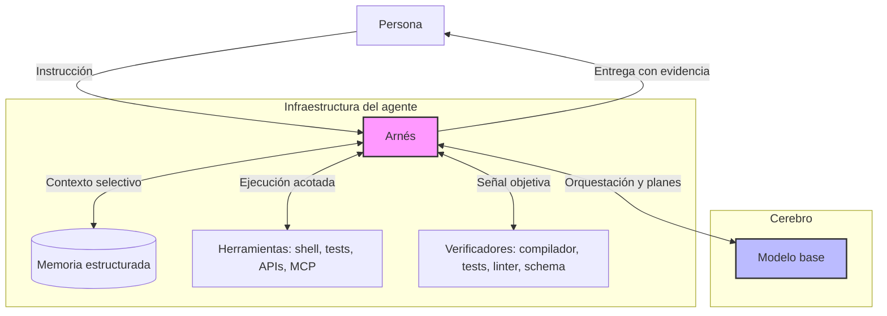
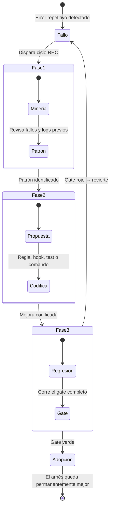
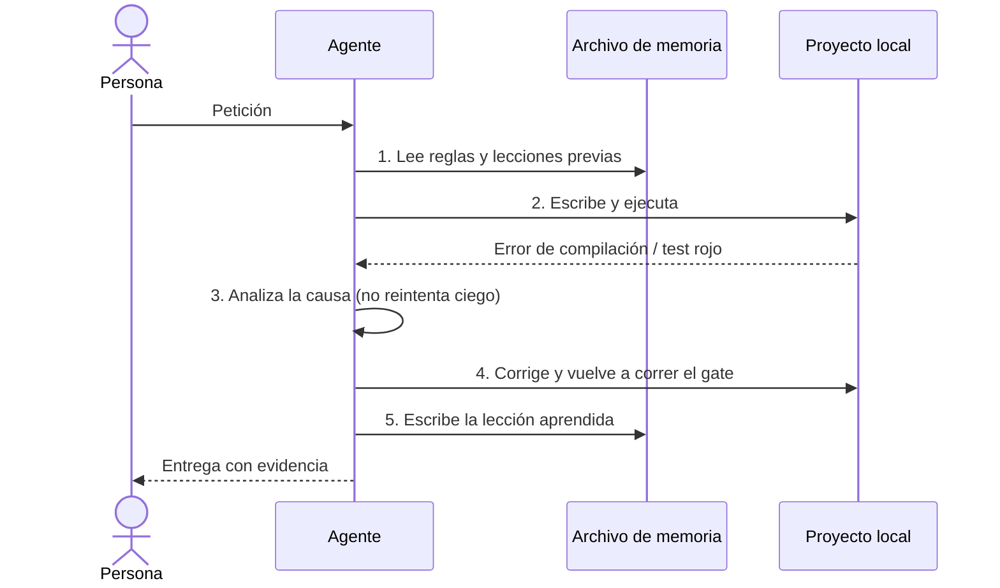

# Ingeniería de Arnés (Agent Harness) — Buenas prácticas para cualquier proyecto de software

> Guía agnóstica de lenguaje, framework y dominio. Sirve para un monorepo frontend, un backend en
> Go, un pipeline de datos o un repo de infraestructura. Donde este documento dice "el comando de
> tests" o "el compilador", cada equipo sustituye la herramienta que le corresponde.

---

## 1. El problema

Un modelo base (LLM) por sí solo es un generador de texto. No conoce las convenciones del repo, no
sabe qué rompió el build el mes pasado, no distingue un archivo regenerable de la llave de
producción, y no tiene forma de comprobar si lo que escribió funciona.

Lo que convierte un modelo en un agente útil sobre **un** repo concreto es la capa de
infraestructura que lo envuelve: el **arnés**. El arnés es código y configuración, no prosa
motivacional. Controla el *agent loop*: qué herramienta se llama, con qué contexto, con qué
permisos, y qué señal decide si el trabajo está terminado.



**Tesis central — *Harness Optimization*:** cuando un agente falla, la reacción típica es "hace
falta un modelo más grande". Casi siempre es más barato y más duradero mejorar el arnés. Un modelo
intermedio con arnés bueno supera a un modelo frontera con arnés estático, y la mejora del arnés se
capitaliza con cualquier modelo futuro; el cambio de modelo es costo recurrente.

---

## 2. El bucle: cinco decisiones que alguien tiene que tomar

Si el arnés no las toma explícitamente, se toman por omisión. Ahí nacen el reintento ciego, la
explosión de contexto y el "listo" sin verificar.

| # | Decisión | Pregunta que responde | Qué pasa si falta |
|---|---|---|---|
| 1 | **Interpretar** | ¿Cuál es la tarea acotada detrás de la intención? | El agente resuelve la ambigüedad por su cuenta, en silencio |
| 2 | **Planificar** | ¿Cómo se descompone? ¿Qué rutas hay? | Trabajo que hay que deshacer |
| 3 | **Ejecutar** | ¿Qué herramienta, con qué permisos y alcance? | Acciones irreversibles sin red de seguridad |
| 4 | **Verificar** | ¿Qué señal objetiva prueba que funciona? | Reporta éxito sin evidencia |
| 5 | **Memorizar** | ¿Qué lección queda escrita? | El mismo error se vuelve a pagar con tokens nuevos |

Los pasos 1 y 5 son los que más se omiten y los que más rinden. El 4 es el que no es negociable.

---

## 3. Los cuatro pilares

### Pilar 1 — Memoria estructurada

**Fallo que evita:** *explosión de contexto* — volcar el repo completo al prompt, confundir al
modelo y quemar tokens.

Buenas prácticas:

- **Un archivo de reglas en la raíz** (`AGENTS.md` o el equivalente de tu herramienta) que se carga
  siempre. Es la memoria de largo plazo del equipo, versionada en git y revisada en PR como
  cualquier código.
- **Guardar solo lo no derivable.** El agente puede leer el árbol de archivos y el `git log`. No
  puede inferir *por qué* se hizo así ni *qué explotó una vez*. Anti-patrón: memoria que repite lo
  que el repo ya dice.
- **Recuperación selectiva antes que lectura amplia.** Un índice del código (grafo de símbolos,
  búsqueda semántica, wiki generada) que devuelva un subgrafo relevante en vez del árbol completo.
  Regla operativa: *primero consultar el índice, después abrir archivos.* Implementación de
  referencia: **graphify** (§9.2).
- **Documentación de dependencias consultable, no recordada.** El modelo conoce las librerías por
  su entrenamiento, con versión difusa. Si no hay una fuente consultable, escribe APIs *de memoria*
  — y ese es el origen de buena parte de los gotchas de cualquier proyecto. Implementación de
  referencia: **tiles de la Tessl Registry** (§9.1).
- **Registrar cada gotcha caro en el momento en que se paga**, no "cuando haya tiempo". El formato
  que funciona son tres líneas: **síntoma observable → causa raíz → regla**.
- **Evidencia de estado verificado** en un documento corto (`STATUS.md` / `DELIVERY.md`): número de
  tests, builds que pasan, deuda conocida. Evita releer código para responder "¿esto anda?".

Ejemplo de entrada de memoria bien escrita:

```md
### GOTCHA: el primer request se escapa a la red real
Síntoma: `ERR_NAME_NOT_RESOLVED` intermitente en el arranque, solo la primera vez.
Causa:   el interceptor de mocks se registra async; el bootstrap no lo espera.
Regla:   tras iniciar el mock, sondear un endpoint hasta 200 con timeout corto
         ANTES de bootstrapear. No confiar en el evento de "listo" del worker.
```

**Higiene de memoria:** revisar el archivo cada trimestre. Una regla que ya está garantizada por un
test automático se borra del markdown — el test es la fuente de verdad y la regla duplicada solo
gasta contexto.

---

### Pilar 2 — Planificación y orquestación

**Fallo que evita:** ejecución impulsiva; el agente empieza a editar en el primer archivo que
encuentra.

Buenas prácticas:

- **Fases explícitas antes de tocar producción.** El patrón mínimo viable, agnóstico de metodología:

  ```
  constitución → especificar → planificar → checklist → definir pruebas
              → tareas → analizar consistencia → implementar
  ```

  La regla dura: **nada de código de producción sin especificación, plan y lista de tareas**. Y muy
  importante: esa regla tiene que poder *bloquear*. Si no hay artefactos de fase en el repo, la
  regla está instalada y muerta (ver §6).
- **Descubrimiento de dependencias durante el plan (*Tile Discovery*).** Antes de escribir una
  línea: por cada librería que el plan va a usar, ¿existe documentación consultable registrada? Si
  no, conseguirla es una tarea del plan, no una improvisación de la implementación. Es el paso que
  convierte "el agente sabrá usar esta librería" en una verificación explícita.
- **Un paso de análisis de consistencia** antes de implementar: ¿cada requisito traza a una tarea?
  ¿el stack del plan coincide con los paths que se van a tocar? ¿hay tareas huérfanas? ¿toda
  dependencia del plan tiene tile o doc vendorizada?
- **Dry-run obligatorio para acciones amplias.** Antes de borrar, mover, renombrar o migrar en
  lote: mostrar la lista, esperar confirmación, después ejecutar.
- **Subagentes para aislar contexto.** La exploración amplia contamina el resto de la tarea; el
  review lo debería hacer alguien que no escribió el código. Delegar a contextos separados:
  *explorador* (busca y resume, no edita), *revisor* (lee el diff con criterios fijos),
  *ejecutor de gate* (corre las señales y reporta). Sin esto, todo corre en el contexto principal.
- **Comandos para flujos repetibles.** Si un flujo se re-tipea a mano cada vez (correr el gate
  completo, registrar una lección, abrir una fase), va en un comando o script versionado.
- **Simetría con el producto:** los sistemas que se configuran por definición declarada y validan
  esa definición antes de ejecutar son más fáciles de operar por agentes. El mismo principio que
  se le exige al arnés — reglas declaradas, verificación antes de entregar — suele mejorar el
  diseño del software.

---

### Pilar 3 — Recuperación de errores y control por feedback

**Fallo que evita:** *reintento ciego* — "falló, intenta otra vez" con los mismos parámetros. Y su
gemelo: reportar "listo" sin señal verde.

#### El gate de señales

Todo proyecto necesita un conjunto pequeño, nombrado y ejecutable de señales objetivas. Nada se
entrega sin ellas. Plantilla genérica:

| Señal | Qué prueba | Por qué no la cubre otra |
|---|---|---|
| **Tests unitarios / integración** | el comportamiento esperado | no ve errores de tipos ni de empaquetado |
| **Type-check / compilación completa** | que el proyecto realmente compila | muchos runners transpilan por archivo y **no** hacen type-check: un import inválido pasa los tests y rompe el build |
| **Linter / formateo** | convenciones, patrones prohibidos | barato, atrapa clases enteras de error |
| **Build de producción / empaquetado** | que el artefacto publicable se genera | dev y prod difieren (tree-shaking, optimizaciones, resolución de módulos) |
| **Test de contrato de frontera** | que el sistema solo habla con quien debe | ningún test unitario detecta una llamada de red extra |
| **Validación de esquema/configuración** | falla cerrada con causa, en vez de romper en runtime | |

**Regla de oro:** *test verde ≠ compila*. Si el gate tiene una sola señal, está incompleto.

#### Reglas de conducta ante el error

- **Integridad de aserciones:** jamás ajustar la aserción para que pase el test. Si el test es
  correcto, se arregla producción. Si el test es incorrecto, se corrige *en un commit aparte* con
  justificación.
- **Prohibido saltar los hooks de verificación** (`--no-verify` y equivalentes). Si el gate estorba,
  se arregla el gate.
- **Leer el error antes de reintentar.** El arnés debe forzar la lectura de la salida real: mensaje,
  archivo, línea. Reintentar solo con hipótesis nueva.
- **Fallar rápido y con causa** vale más que degradar en silencio. Un error explícito de
  configuración es mejor que una pantalla en blanco.
- **Presupuesto de intentos.** Tras N intentos fallidos sobre el mismo error (2 o 3), el agente
  para y escala con el diagnóstico, en vez de gastar contexto en variaciones.

#### Automatizar el gate con hooks

Los ganchos del ciclo de vida del agente son el freno más barato que existe:

| Momento | Uso típico | Ejemplo concreto |
|---|---|---|
| **Al iniciar sesión** | cargar estado del proyecto, rama actual, deuda conocida | imprimir `STATUS.md` + rama + si el índice está fresco |
| **Antes de una herramienta** | reorientar búsquedas amplias al índice; bloquear rutas protegidas | `graphify hook-guard search\|read` intercepta `Grep`/`Glob` y sugiere `graphify query` |
| **Después de una herramienta** | type-check o linter automático tras cada edición ← el de mayor retorno | correr el type-checker sobre el archivo tocado y devolver el error al agente |
| **Al cerrar** | impedir terminar la tarea sin gate verde | bloquear el fin de turno si `scripts/gate.sh` no corrió o salió distinto de cero |

Y en el repo, no solo en el agente: **pre-commit instalado de verdad** (`.git/hooks/` con hooks
reales, no solo los `.sample`) y CI que corra el mismo gate. Si la integridad depende de disciplina
humana, no es un gate.

---

### Pilar 4 — Herramientas y seguridad (sandbox)

**Fallo que evita:** acción irreversible sobre el mundo real.

Buenas prácticas:

- **Sandbox por defecto.** El agente trabaja contra dobles de prueba (mocks, contenedores
  efímeros, bases de datos de prueba, entornos con datos sintéticos). El paso de mock a real es un
  cambio de configuración, nunca de código.
- **Determinismo.** Nada de reloj del sistema, aleatoriedad sin semilla ni dependencia de red en
  las pruebas. Sin determinismo no hay señal confiable y todo el pilar 3 se cae.
- **Frontera única y verificable.** Definir por dónde el sistema habla con el exterior y tener un
  test que pruebe que no hay atajos (por ejemplo, que la lista de llamadas externas está vacía).
- **Herramientas nombradas, no acceso libre.** Declarar explícitamente qué servidores/integraciones
  puede usar el agente. Lista blanca de dominios de red. Credenciales de solo lectura donde
  alcance.
- **Reversibilidad antes de cualquier operación masiva.** Commit o backup previo. Sin excepción.
- **Rutas protegidas y explícitas:** secretos, migraciones aplicadas, infraestructura, artefactos
  firmados, historia de git. Directorios de solo lectura para el agente.

> **Incidente arquetípico.** Un `sed`/`perl` con regex amplia sobre el directorio fuente destruye
> archivos. La orden era razonable, la ejecución fue eficiente, el resultado fue pérdida de código.
> La regla que queda: *ediciones masivas solo con commit o backup previo, y siempre con dry-run.*

---

## 4. Self-harness: Optimización Retrospectiva del Arnés (RHO)

RHO = el arnés mejora a partir de sus propios fallos, en vez de esperar a que alguien encuentre
tiempo para escribir mejores reglas. El humano puede seguir en el loop; lo importante es que el
ciclo exista y que tenga gate.



**La Fase 3 es el diseño entero.** Sin gate de regresión, "auto-mejora" significa que el agente
reescribe sus propias reglas sin control. El gate es lo que convierte esto en ingeniería.

### Las tres fases, aterrizadas

1. **Minería de debilidades.** Fuentes: incidentes que costaron horas, PRs con muchas rondas de
   review, builds rotos, preguntas que el equipo repite, y los propios reintentos del agente.
2. **Propuesta de arnés.** La mejora se codifica **donde actúa**, eligiendo el mecanismo más fuerte
   disponible:

   | Mecanismo | Fuerza | Cuándo usarlo |
   |---|---|---|
   | Test o validación de esquema | máxima (bloquea) | la regla es verificable por máquina |
   | Hook / pre-commit / CI | alta (bloquea) | hay una acción que debe frenarse siempre |
   | Comando o script | media (facilita lo correcto) | el flujo correcto es tedioso de tipear |
   | Regla en el archivo de memoria | baja (informa) | es contexto o criterio, no verificable |

   Preferir siempre el más fuerte. Una regla en markdown es el último recurso, no el primero.
3. **Validación por regresión.** Correr el gate completo. Si la mejora no rompe lo que ya andaba,
   queda; si rompe, se revierte y se documenta el intento.

### Ciclo local, en la terminal

No podemos modificar el modelo base, pero el arnés es el entorno del proyecto — reglas, hooks,
scripts, memoria — y eso sí lo controlamos. Ahí ocurre el aprendizaje.



El paso 5 es el que compone: la lección deja de vivir en la cabeza de quien la sufrió y pasa a ser
parte del proyecto.

---

## 5. El caso didáctico: «borra lo que es basura»

Un prompt de seis palabras explica el arnés mejor que cualquier definición. "Basura" no es un tipo
de dato ni una etiqueta del repo, y la ambigüedad es real en cualquier proyecto:

- dependencias instaladas y artefactos de build → **sí**, regenerables;
- archivos de entorno local → parecen basura y son **la llave del reino**;
- pruebas que fallan → son **el contrato**, no ruido;
- documentos fuente del negocio tirados en la raíz → **la fuente de verdad**;
- índices y cachés generados → regenerables, pero cuestan un reindex.

Sin arnés, el agente **no falla**: resuelve la ambigüedad por su cuenta y ejecuta con eficiencia.
El diagnóstico correcto no es "el modelo alucinó"; son frenos ausentes.

| Lo que diría alguien prudente | Nombre técnico | Pilar |
|---|---|---|
| «¿Basura de qué tipo, exactamente?» | desambiguación de intención | bucle, paso 1 |
| «Primero enséñame la lista» | planificación + dry-run | pilar 2 |
| «¿Confirmas que borro estos 1.239?» | permiso explícito para acción irreversible | pilar 4 |
| «Primero hago commit» | reversibilidad / sandbox | pilar 4 |
| «¿Sigue compilando?» | control por feedback | pilar 3 |
| «Lo apunto para no repetirlo» | memoria estructurada / RHO | pilar 1 |

### Otros prompts que suenan inocentes

| Prompt | Riesgo | Freno del arnés |
|---|---|---|
| «Arregla los tests» | editar la aserción hasta que pase | integridad de aserciones: se arregla producción |
| «Limpia esto» | alcance indefinido | acotar + dry-run antes de tocar disco |
| «Actualiza todo» | major silencioso que rompe el build | por lotes, con gate entre cada uno |
| «Hazlo rápido» | saltar la verificación | sin señal verde no hay "listo" |
| «Ya sabes cómo lo hacemos» | contexto supuesto, nunca escrito | por eso existe el archivo de memoria |
| «Commit y push, confío» | push a rama principal sin gate | rama + pre-commit; nunca `--no-verify` |
| «Migra la base y avísame» | irreversible sobre datos reales | entorno de prueba, dry-run, backup, aprobación |
| «Copia el patrón del otro repo» | importa deuda ajena sin contexto | revisar contra las reglas propias primero |

---

## 6. Anti-patrón mayor: "instalado y muerto"

El falso positivo más peligroso de una auditoría de arnés: **los archivos existen y el eslabón que
los activa nunca se ejecutó.** A primera vista todo está en su lugar.

Formas habituales:

| Síntoma | Realidad |
|---|---|
| Flujo de fases instalado, pero el repo no tiene ni una especificación | la regla "sin producción sin spec" nunca puede bloquear |
| El archivo de memoria cita una "Constitución" que no existe como archivo | el principio es convención oral, no está versionado |
| El archivo de memoria manda consultar un índice que nunca se generó | una instrucción del arnés apunta a la nada |
| Solo hay hooks *antes* de la herramienta | falta el type-check automático y el gate de cierre, los más baratos |
| Hay integración con librerías de documentación, pero cero fuentes registradas | el agente escribe APIs **de memoria**: origen de la mitad de los gotchas |
| `.git/hooks/` solo tiene los `.sample` | la disciplina no es un gate |
| Cero subagentes | todo en el contexto principal: la exploración contamina, y el review lo hace el autor |
| Cero comandos | los flujos repetibles se re-tipean a mano cada vez |

**Prueba de vida:** para cada regla del arnés, responder *"¿qué comando concreto falla si alguien la
viola?"*. Si la respuesta es "ninguno, confiamos", esa regla está muerta.

---

## 7. Modelo de madurez

| Nivel | Estado | Señal de que estás aquí |
|---|---|---|
| **L0 — Ad hoc** | prompts sueltos, cero configuración | cada sesión reexplica el proyecto |
| **L1 — Memoria** | archivo de reglas en la raíz, versionado; gotchas registrados | el agente ya no rompe lo mismo dos veces… si lee el archivo |
| **L2 — Gate** | gate de señales nombrado y ejecutable; pre-commit y CI reales | "listo" siempre viene con evidencia |
| **L3 — Automatización** | hooks en el ciclo del agente, comandos, recuperación selectiva, sandbox y rutas protegidas | los errores de entorno fallan rápido y con causa |
| **L4 — Self-harness** | ciclo RHO activo con gate de regresión; subagentes; arnés portable a otros repos | cada incidente deja infraestructura, no solo un fix |

La mayoría de los equipos cree estar en L3 y está en L1 con archivos de L3 presentes pero inertes
(§6). Subir de nivel **no requiere cambiar de modelo**: requiere infraestructura.

---

## 8. Checklist de auditoría

**Memoria**
- [ ] Existe un archivo de reglas en la raíz que se carga en toda sesión.
- [ ] Contiene solo lo no derivable del repo (decisiones, gotchas, invariantes).
- [ ] Cada gotcha está en formato síntoma → causa → regla.
- [ ] Toda ruta o herramienta que menciona el archivo **existe de verdad**.
- [ ] Hay recuperación selectiva (índice/grafo/búsqueda) y la regla "índice antes de leer".
- [ ] El índice está **generado** y fresco, y hay un comando documentado para regenerarlo.
- [ ] Cada dependencia central tiene tile registrado o documentación vendorizada, con versión fijada.
- [ ] El registro de tiles (`tessl.json` o equivalente) lista dependencias reales, no solo a sí mismo.

**Planificación**
- [ ] Hay artefactos de fase reales para el trabajo en curso, no solo la plantilla.
- [ ] Las acciones amplias exigen dry-run y confirmación.
- [ ] Existen subagentes para exploración y para review.
- [ ] Los flujos repetibles están en comandos o scripts.

**Verificación**
- [ ] El gate está nombrado, documentado y es un comando ejecutable.
- [ ] Incluye al menos: tests, type-check/compilación, y build de producción.
- [ ] Hay un test de frontera que prueba que no hay llamadas externas indebidas.
- [ ] Hay validación de esquema para la configuración crítica.
- [ ] Pre-commit instalado (no `.sample`) y CI corriendo el mismo gate.
- [ ] Hay hook de type-check después de cada edición.
- [ ] Regla escrita: no se toca la aserción para que pase el test.

**Sandbox**
- [ ] El agente trabaja contra dobles de prueba por defecto.
- [ ] Las pruebas son deterministas (reloj y aleatoriedad controlados).
- [ ] Lista explícita de herramientas/integraciones y dominios permitidos.
- [ ] Rutas protegidas declaradas (secretos, migraciones, infra).

**RHO**
- [ ] Cada incidente genera una mejora codificada, con el mecanismo más fuerte posible.
- [ ] Toda mejora del arnés pasa el gate antes de quedar.
- [ ] Se revisa la memoria periódicamente y se borra lo que ya cubre un test.

---

## 9. Catálogo de herramientas del arnés

Los pilares son el *qué*; esta sección es el *con qué*. La columna de ejemplos no es prescriptiva:
lo que importa es que cada necesidad tenga una herramienta asignada y viva.

| Necesidad del arnés | Pilar | Ejemplos de implementación |
|---|---|---|
| Memoria de equipo cargada siempre | 1 | `AGENTS.md` / `CLAUDE.md` en la raíz; ADRs en `docs/decisions/` |
| Recuperación selectiva del código | 1 | **graphify** (grafo + wiki + `query`); índices con tree-sitter/ctags; búsqueda semántica sobre el repo |
| Documentación de librerías consultable | 1 · 2 | **tiles de la Tessl Registry** vía MCP; docs vendorizadas en `docs/vendor/`; `llms.txt` de la librería |
| Especificación y plan versionados | 2 | **framework de Tessl** (`.tessl/RULES.md`, `tessl.json`); flujos tipo spec-kit; carpeta `specs/<feature>/` propia |
| Orquestación y aislamiento de contexto | 2 | subagentes (explorador, revisor, ejecutor de gate); comandos para flujos repetibles |
| Frenos automáticos en el ciclo del agente | 3 | hooks del agente (`SessionStart`, `PreToolUse`, `PostToolUse`, `Stop`) |
| Frenos automáticos en el repo | 3 | pre-commit real (husky, lefthook, `pre-commit`); el mismo gate en CI |
| Señales objetivas | 3 | test runner; type-checker (`tsc --noEmit`, `mypy`, `go vet`); build de producción; tests de contrato (Pact y similares); validación de esquema (JSON Schema, zod, pydantic) |
| Sandbox y determinismo | 4 | dobles de API (MSW, WireMock); contenedores efímeros (Testcontainers); grabación de tráfico (VCR/cassettes); reloj y semilla inyectados |
| Frontera de herramientas del agente | 4 | servidores MCP nombrados en `.mcp.json` (p. ej. uno de especificación y uno de navegador para verificación E2E); lista blanca de dominios |

> **El arnés también es dependencia.** Cada herramienta de esta tabla se somete al mismo criterio
> que el resto del stack: ¿está viva o "instalada y muerta" (§6)? ¿su salida entra al gate? ¿quién
> la actualiza? Un arnés con diez herramientas inertes es peor que uno con tres que muerden.

### 9.1 Tiles: que el agente deje de escribir APIs de memoria

Un **tile** es un paquete de documentación de una librería en formato pensado para que lo consuma un
agente: versionado, acotado y consultable bajo demanda, en vez de volcado al prompt. La **Tessl
Registry** (<https://tessl.io/registry/tessl-labs> para los publicados por Tessl Labs) es el
catálogo público desde donde se registran; el agente los consulta por herramienta —del tipo
`query_library_docs`— expuesta por MCP.

El fallo que corrige es concreto y muy frecuente: el modelo escribe contra la API que recuerda del
entrenamiento, que suele ser una versión anterior. El síntoma no es una alucinación evidente sino
código plausible que no compila, o peor, que compila y se comporta distinto.

Dos momentos de uso, y son distintos:

| Momento | Pregunta | Salida esperada |
|---|---|---|
| **Plan** (*Tile Discovery*) | ¿cada dependencia del plan tiene documentación registrada? | lista de tiles a usar; tarea explícita para las que faltan |
| **Implementación** | ¿cómo se usa esta API en *esta* versión? | consulta puntual antes de escribir, no después de que falle |

Reglas operativas:

- Toda dependencia **central** del proyecto (framework, runner de tests, librería de datos, capa de
  mocks) debe tener tile registrado o documentación vendorizada. Las periféricas pueden esperar.
- Si no existe tile para algo central, la mejora del arnés es **crearlo o vendorizar el subconjunto
  relevante**, no confiar en la memoria del modelo.
- Registrar las dependencias declaradas (`tessl.json` o equivalente) y auditarlo: un archivo que
  solo se lista a sí mismo es el caso de manual de "instalado y muerto".
- Fijar la versión del tile a la versión que el proyecto usa realmente. Un tile desactualizado
  reproduce el problema con un paso extra.

> **Verificar antes de citar.** Los nombres exactos de comandos, herramientas MCP y el contenido de
> la registry cambian; este documento se escribió sin acceso de red a `tessl.io`. Confirmar contra
> la documentación vigente antes de llevar esta sección a un comité o a un onboarding.

### 9.2 Grafo de código: consultar antes de leer

**graphify** indexa el repositorio y produce dos artefactos complementarios:

- `graphify-out/graph.json` — el grafo de símbolos y relaciones, consultable con
  `graphify query "<pregunta>"`, que devuelve un **subgrafo** en lugar del árbol de archivos;
- `graphify-out/wiki/` — navegación en prosa para exploración amplia, cuando la pregunta todavía no
  es precisa.

Cómo se integra al arnés:

1. **Regla en la memoria:** *primero `graphify query`, después abrir archivos.* Enunciarla no basta.
2. **Hook que la empuja:** `graphify hook-guard search|read` en `PreToolUse` intercepta las
   búsquedas y lecturas amplias y reorienta al grafo. Ahí la regla pasa de sugerencia a freno.
3. **Frescura del índice:** regenerar tras cambios estructurales; el hook de inicio de sesión puede
   avisar si está viejo. Un grafo desactualizado apunta a símbolos que ya no existen.
4. **Clasificación del artefacto:** `graphify-out/` es **derivado y regenerable, pero costoso**.
   Va a `.gitignore` y va también a la lista de "no borrar a la ligera" del caso «borra lo que es
   basura» (§5).

Trampa registrada: si la memoria referencia la wiki y la wiki nunca se generó, una instrucción del
arnés apunta a la nada (§6). El paso de generación es parte del setup, no opcional.

**Métrica de éxito:** tokens/contexto por tarea. Si consultar el grafo no baja esa cifra frente a
leer archivos, o el índice está mal construido o las preguntas siguen siendo demasiado amplias.

---

## 10. Estructura de referencia (agnóstica de stack)

Los nombres varían según la herramienta; lo que importa es que cada casilla tenga dueño.

```
repo/
├─ AGENTS.md                  # reglas y memoria de largo plazo (se carga siempre)
├─ CONSTITUTION.md            # principios versionados que no se negocian
├─ STATUS.md                  # estado verificado + deuda conocida (Cx)
├─ .agent/
│  ├─ settings.*              # hooks: inicio, pre/post herramienta, cierre
│  ├─ commands/               # flujos repetibles (gate, lección RHO, abrir fase)
│  ├─ agents/                 # subagentes: explorador, revisor, ejecutor de gate
│  └─ rules/                  # disciplina de fases, integridad de aserciones
├─ specs/<feature>/           # spec.md · plan.md · tasks.md  ← artefactos vivos
├─ tessl.json                 # tiles/dependencias documentadas y su versión
├─ .mcp.json                  # servidores MCP permitidos (nombrados, no acceso libre)
├─ graphify-out/              # DERIVADO: graph.json + wiki/ (gitignore, regenerable)
├─ scripts/gate.sh            # el gate completo, en un comando
├─ .git/hooks/pre-commit      # real, no .sample
├─ ci/                        # el mismo gate en el pipeline
└─ docs/decisions/            # ADRs: por qué, no qué
```

Regeneración de los artefactos derivados (documentar el comando exacto de tu stack):

```bash
graphify index          # reconstruye graph.json y wiki/
scripts/gate.sh         # tests + type-check + build, en un solo comando
```

---

## 11. Adopción en cinco pasos

Cada paso es útil por sí solo; no hace falta el conjunto para ver retorno.

1. **Día 1 — Un archivo de reglas.** Escribir las 10 cosas que un recién llegado rompería.
   Versionarlo. Revisarlo en PR como código.
2. **Día 2 — Un comando de gate.** `scripts/gate.sh` que corra tests + type-check + build y salga
   con código distinto de cero. Documentar que nada se entrega sin él.
3. **Semana 1 — Hooks.** Type-check automático después de cada edición y bloqueo de cierre sin gate
   verde. Instalar pre-commit real.
4. **Semana 2 — Recuperación selectiva, tiles y sandbox.** Generar el índice del código
   (`graphify index`) y enganchar el hook que reorienta las búsquedas; registrar tiles para las
   dependencias centrales; dobles de prueba deterministas; rutas protegidas y `.mcp.json` con
   servidores nombrados.
5. **Continuo — Ciclo RHO.** Cada incidente termina con una mejora codificada que pasó el gate. Al
   cabo de unos meses, extraer el andamiaje a una plantilla portable para los demás repos.

### Métricas que muestran si funciona

- **Reincidencia:** ¿cuántos incidentes son repetición de uno ya registrado? Debe tender a cero.
- **Tokens/contexto por tarea:** la recuperación selectiva lo baja de forma directa y medible.
- **Rondas de review por PR:** el revisor deja de señalar lo que el gate ya atrapa.
- **Tiempo de "falla a causa conocida":** cuánto tarda un error de entorno en dar un mensaje útil.
- **Cobertura de reglas por gate:** % de reglas del arnés que tienen un comando que las hace fallar.

---

## Cierre

Tres ideas para llevarse:

1. **El arnés es infraestructura, no prosa.** Una regla sin un comando que la haga fallar es una
   sugerencia.
2. **Test verde ≠ compila ≠ entregable.** El gate necesita varias señales o no es un gate.
3. **Las mejoras del arnés se capitalizan; los cambios de modelo se pagan cada vez.** Empezar por
   ahí es la decisión económicamente correcta.
